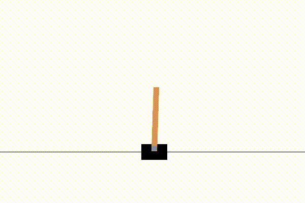
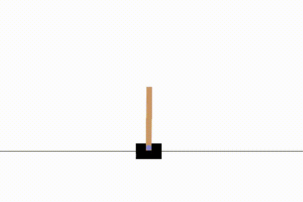
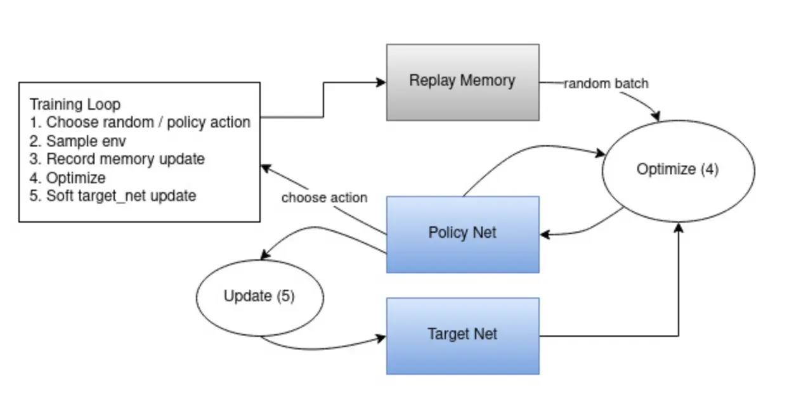

# Cart-Pole Reinforcement Learning
_____

## Overview

This project implements a reinforcement learning solution for the classic Cart-Pole problem presented by Barto, Sutton, and Anderson, in which a pole is attached by an joint to a cart, which moves along a frictionless track. The pendulum starts upright and the goal is to balance the pole by applying forces in the left and right direction. 

In this project, I approximate the optimal action-value function using a Deep Q-Network (DQN): a small feedforward neural network with two hidden layers of 64 units each that maps states to Q-values for the two actions. 

*General approach and methods:*

To stabilize training  maintain a separate “target” network that is periodically synchronized with the policy network, and leverage an experience replay buffer to break temporal correlations between successive transitions. Exploration is controlled via an $\varepsilon$-greedy schedule, and network parameters are updated by minimizing the mean-squared Bellman error with Adam and an exponential learning-rate decay. Using this setup, the agent consistently learns to achieve an average reward above 195 over 100 consecutive episodes (the conventional “solved” criterion) in fewer than 500 episodes.

All code—model definitions, training loop, evaluation scripts, and visualization utilities—is included in this repository, along with configuration options for hyperparameters such as learning rate, discount factor, replay-buffer size, and exploration schedule. 


## Features

1) Implementation of reinforcement learning algorithms.

2) Epsilon-greedy exploration schedule

3) Detailed curve plotting
    1) Live plotting of training
    2) Trial vs. train rewards
    3) Trial vs. test rewards
    4) Epsilon Decay

4) Periodic recordings of model performance throughout training


## File Structure
- `agent.py`: Contains the `Agent` class, which manages the policy and target networks, handles action selection, experience replay, and coordinates the training process.
- `export.py`: Utility functions for saving and exporting trained models and results.
- `model.py`: Defines the neural network architecture (`DQN` class) and the `QTrainer` class for computing Q-values and performing optimization steps.
- `plot.py`: Functions for generating and saving training and evaluation plots, such as reward curves and epsilon decay.
- `test.py`: Script for evaluating the trained agent's performance and visualizing results.
- `train.py`: Main script for training the model, including environment setup, agent initialization, and training loop.
- `plots/`: Folder to store generated plots from training and testing sessions.
- `recordings/`: Folder for storing periodic recordings and visualizations of model performance.


## Results

#### Sample Learning Performance





#### Model Progress Over Trials


## Installation

1. Clone the repository:
    ```bash
    git clone https://github.com/your-username/Cart-Pole-RL.git
    ```
2. Navigate to the project directory:
    ```bash
    cd Cart-Pole-RL
    ```
3. Install dependencies:
    ```bash
    pip install -r requirements.txt
    ```
4. Train the model via running Train, *e.g.*:

```bash
python train.py
```
5. Visualize the trained model via the test file
```bash
python test.py
```

# Theory and Mathematics
______

## Model Architecture

***Input Layer:***
`Dimension` = `state space size`
- 4 for Cart-Pole: (position, velocity, angle, angular velocity)


***Hidden Layers:***

1. Fully-connected layer (Linear): `state_dim` → 64
	1. Relu Activation

2. Fully-connected layer (Linear): 64 → 64
	1. Relu Activation

***Output Layer:***
3. Fully-connected layer (Linear): 64 → 2

## Training Methodology



- ***Source:** Pytorch: Reinforcement Learning (DQN) Tutorial*

#### Key Classes

The training of the model is done with several componets combined:

*QTrainer class:* implemented in `model.py` and includes calculation of Q-values of target and policy nets
*Agent class:* includes initialization of key values (e.g. epsilon), target and policy nets, QTrainer instance, and trial memory


`policy net`: optimized continuously over training
`target net:` updated with policy net weights every 5 steps

#### Full Steps of Training Schedule

This section comprehensively documents every step of the training schedule. 

**Step 1:** Environment interaction

- At each time step $t$, the agent observes state $s_t$ (cart position, cart velocity, pole angle, pole angular velocity; defined by Gymnasium)
- It selects an action $a_t$ by sampling from a softmax over Q-values:

$$\pi(a|s)\propto \exp(Q_{\text{policy}}(s,a))$$

- Execute $a_t$, receives reward $r_t$ and next state $s_{t+1}$
- Store ($s_t,a_t,r_t,s_{t+1},\text{done}$) in a replay buffer of capacity 70 000.

**Step 2:** Experience Replay

- Once buffer $\text{size} \geq \text{batch size} (128),$ sample a random mini-batch of transitions each training step
- This breaks correlations in the data and stabilizes learning.


 **Step 3:** Target Q-Value Computation

- The computation of Q-values is implemented within the `QTrainer` class, as mentioned previously. The class is called within the agent’s train function

*Inputs:* batches of  `(states, actions, rewards, next_states, dones)`

- Compute target Q-values using the target network. The implemented formula is:

$$\text{target} = r + \gamma \,\max_{a{\prime}} Q_{\text{target}}(s{\prime}, a{\prime}) \times (1 - \text{done})$$

- Compute predicted Q-values for the taken actions from the policy net:
$$Q_{\text{pred}} = Q_{\text{policy}}(s, a)$$

- Finally, compute the MSE loss between $Q_pred$ and target:

$$
L=\frac{1}{B}\sum_i (Q_{policy}(s_i,a_i)-y_i)^2
$$

- Backpropagate and optimizer step on the policy network to minimize this Bellman‐error loss

**Step 4:** Target Network Sync

- Every $N$ episodes (or steps), copy policy weights to the target network to stabilize bootstrapping


Exploration Schedule
Start with $\epsilon=1.0$ (pure exploration), decay by $\times0.997$ each episode down to $\epsilon_{\min}=0.01$

In code we convert Q-values via softmax, but you can equivalently do ε-greedy on raw Qs

**Hyperparameters:**
Replay buffer size: 70 000
Batch size: 128
Discount factor \gamma: 0.99
Initial LR: 0.001, decayed by 0.99^episode
$\varepsilon$-decay: 0.997 per episode, min 0.01
Target‐network update frequency: configurable (e.g. every 5 episodes)

## Potential Expansions

Below are potential improvements to be made to the code:
1. More sophisticated epsilon decay structure, rather than the constant decay factor currently
2. Further plots, including:
	1. Loss plot
	2. Q-value plot
	3. Others
3. Further improvements to be explored via methods defined in Sutton & Barto’s book


Since this project was primarily build for learning purposes, the model is made to be easily generalized to other reinforcement learning problems.

Further experimentation will be conducted on my github page. 

## License
This project is licensed under the [MIT License](LICENSE).

## Acknowledgments
- [OpenAI Gym](https://www.gymlibrary.dev/) for the Cart-Pole environment.
- [Pytorch Reinforcement Learning (DQN) tutorial](https://pytorch.org/tutorials/intermediate/reinforcement_q_learning.html) for guidance on model and training


